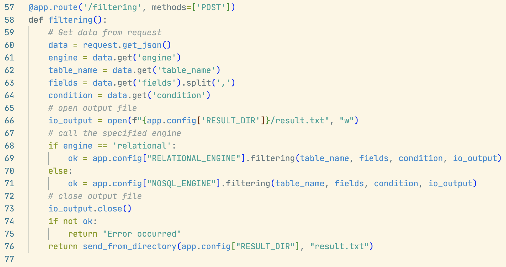
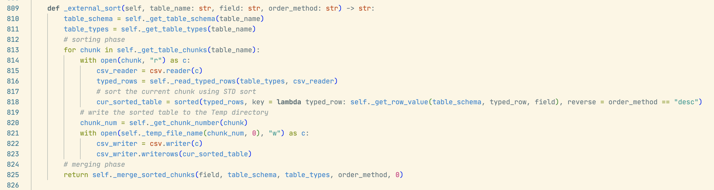

[TOC]

# Introduction

We are a three person team (group 34) and we built a database system called AwesomeDB. We designed different database engine for our database system that provides support for relational and nosql functionalities. We provided two real-life large datasets form kaggle, `movies.csv` and `rotten_tomatoes_movies.csv` for testing our databases. Since the two data set doesn't have tables to be joined, we also supplied the `joinTable1.csv` and `joinTable2.csv` for testing join operations. All storage and operations are processed in chunks so that we only need to load a limited amount of data into main memory at a time. This project also provides a CLI and Web app for users to interact with our database system. We also designed a query language of our own to query the database in the CLI.

# Planned Implementation

# Architecture Design

## Flow Diagram


## Modules Description

```bash
.
├── Engine                  # The database engines
│   ├── base.py             # The abstract base engine
│   ├── nosql.py            # The NoSQL engine: implements all NoSQL operations
│   └── relational.py       # The relational engine: all relational operations
├── Results                 # The results generated by backend, send to frontend
│   └── result.txt
├── Storage                 # Stores all table data
│   ├── NoSQL               # Storage for NoSQL, each subdir is a table
│   │   ├── table_1
│   │   │   ├── chunk_1     # chunks for table_1 in NoSQL DB
│   │   │   ├── chunk_2
│   │   │   ...
│   │   ├── table_2         # Another table in NoSQL DB
│   │   │
│   │   ...
│   └── Relational          # Storage for Relational, each subdir is a table
│   │   ├── table_1
│   │   │   ├── chunk_1     # chunks for table_1 in relational DB
│   │   │   ├── chunk_2
│   │   │   ├── schema.txt  # Relational tables have schemas
│   │   │   ...
│   │   ├── table_2         # Another table in relational DB
│   │   │
│   │   ...
├── Temp                    # For temporary data during processing
├── ToBeLoaded              # Put datasets (.csv) to be loaded in this directory
│   └── movies.csv          # A dataset that can be loaded into Storage
├── config.py               # Configs of this system
├── main.py                 # Entry of the CLI
├── run.py                  # Starts the web server
├── static                  # Static data of the web server
│   ├── index.html
│   └── script.js
├── utils                   # Utility functions/Class during processing
│   ├── DocElement.py
│   ├── RowElement.py
│   ├── util.py
│
...
```

# Implementation

## Storage and Chunking

We store all data loaded in our database under the the `/Storage` directory.

```bash
.
├── Storage                 # Stores all table data
│   ├── NoSQL               # Storage for NoSQL, each subdir is a table
│   │   ├── table_1
│   │   │   ├── chunk_1     # chunks for table_1 in NoSQL DB
│   │   │   ├── chunk_2
│   │   │   ...
│   │   ├── table_2         # Another table in NoSQL DB
│   │   │
│   │   ...
│   └── Relational          # Storage for Relational, each subdir is a table
│   │   ├── table_1
│   │   │   ├── chunk_1     # chunks for table_1 in relational DB
│   │   │   ├── chunk_2
│   │   │   ├── schema.txt  # Relational tables have schemas
│   │   │   ...
│   │   ├── table_2         # Another table in relational DB
│   │   │
│   │   ...
```


Once a dataset is loaded into our database, it is stored in chunks. To load a database, it is first stored/uploaded by the user to the `/ToBeLoaded` directory. Then, the database engine calls the `load_data()` which calls the `_insert_row()` or `_insert_doc()` function. This function detects if the chunk with largest chunk number is full. If it is not full, we insert the row/doc into that chunk, otherwise, we have to create a new chunk and store the new row/doc in that chunk. Once a user inserts a new data the engine also calls the `_insert_row()` or `_insert_doc()` function.

For relational data, we store the chunks as `.csv` files. We also have a `schema.txt` for each table to record the schema and data types of each row.

For NoSQL storage, all data are stored as JSON docs. Therefore, we don't store the chunks as `.csv` but as a text file with no file extension. Each line in the chunks is a string that can be deserialized into JSON docs.

The `CHUNK_SIZE` is specified in the `/config.py` file.

Following is a screenshots of the `_insert_row()` function.


## CLI

Use `python3 main.py` to start a CLI of our program. Follow the prompt to type queries.


Our queries are parsed and validated using regular expression. The keywords in the queries are extracted in the `parse_and_execute()` function in the `BaseEngine` class and passed to execution functions. Following is a screenshot of the regular expression of our queries.


## Web App

We use Flask for backend and serves the `/static/index.html` as static files to our user. The `index.html` are styled using Bootstrap. The `/static/script.js` is linked with the page and it uses `async/await` with fetch API to make HTTP POST request to the backend and receives the result file and display the content in the result display section.

To start the backend server, run `python3 run.py`. Use a web browser to navigate to the index page hosted our local server.

Following is a screenshot of the web page and the query result of showing the fields `name,rating` from the movies dataset.


The backend receives the HTTP request and choose the corresponding database engine to execute the query. Then it sends back a result file to the front end. Following is a description of the web backend function to filter data.



## Insertion

The insertion method calls the `_insert_row()` or `_insert_doc()` functions as we discussed about in the <u>Storage and Chunking</u> section. Following is a screenshot of the relational insertion.


## Deletion/Updating/Projection/Filtering

All of the four methods take a similar approach to do the operation in chunks. 

1. The system loads one chunk into memory
2. Find the rows/docs that satisfies the condition, 
3. Then process each row/doc, and print the result to the `io_output`. 

Then the system then proceeds to the next chunk. Below is an example of how deletion works in relational DB.


## Sorting

The key part of sorting is to implement external merge sort. It is split into two phases.

Sorting phase:

1. The system loads one chunk into memory
2. Sort the chunk, copy the result into the temp folder
3. Close the reader
4. Proceed to the next chunk
5. ....

Below is the implementation of the sorting phase



After the sorting phase, the temp folders are filled with sorted chunks. We can now start the mergine phase using $k-$way mergine where $k$ is the `CHUNK_SIZE`

1. For `CHUNK_SIZE` number of runs, group them into 1 merge group
2. Load one row/doc from each run in the current merge group into a priority queue.
3. Poll the largest/smallest elements write to another run for the next pass, and load next row/doc from the same run if there are any row/doc remaining.
4. Proceed to the next merge group.
5. If we are done with the current pass, we proceed to the next pass.

After all the runs are merged into one run in the temp dir, we return the path of the result.

The following is a screenshot of the merging phase.


Then we can called the `_external_sort()` method to get a path in the temp directory that stores the sorted data.

## Join

For both relational and NoSQL database, we implemented an inner join. We use nested loop join for the relational database and block nested loop join for the NoSQL database. The difference is the result of the difference of the helper method we designed to retreive data from chunks.

Following is a screenshot of the NoSQL join operation.


Note that for both databases we are using the right table as the outter table because we are doing a convertion of condition in the inner loop to satisfy the design of the `_doc_meets_condition()` method. If we use the left table as the outter table, we have to reverse the operator `op`. Using right table as the outter table should be an simpler approach to tackle the same issue. The performance should be the same no matter which table serves as the outter table.

## Group and Aggregation

For group and aggregation, we utilized the external sort method we implemented as described in the <u>sorting</u> section. We support `max, min, sum, avg, count` as aggregation functions. To perform an aggregation with groupping:

1. Do external sort based on the `group_field` on this table and get the temporary sorted file.

2. Read the result row by row

   \* Python `next(reader)` method optimized the function so that it wouldn't load the entire file into memory when we iterate through each row in a file.

3. If the value of the `group_field` changes, we know that we have iterated all the previous group. So we can now output the result of the previous group.

4. We proceed to the next row until end of file

Below is a screenshot of the aggregation and groupping in the NoSQL database.


We also supports and optimized the cases to 

- aggregate a whole table without groupping (the `aggregate_table()` method) and 

  $\rightarrow$ scan the whole table as in filtering without external sorting

- groupping without aggregation (the `group()` method)

  $\rightarrow$ basically remove duplicated values in the group field


# Learning Outcomes

# Individual Contribution

# Conclusion

# Future Scope